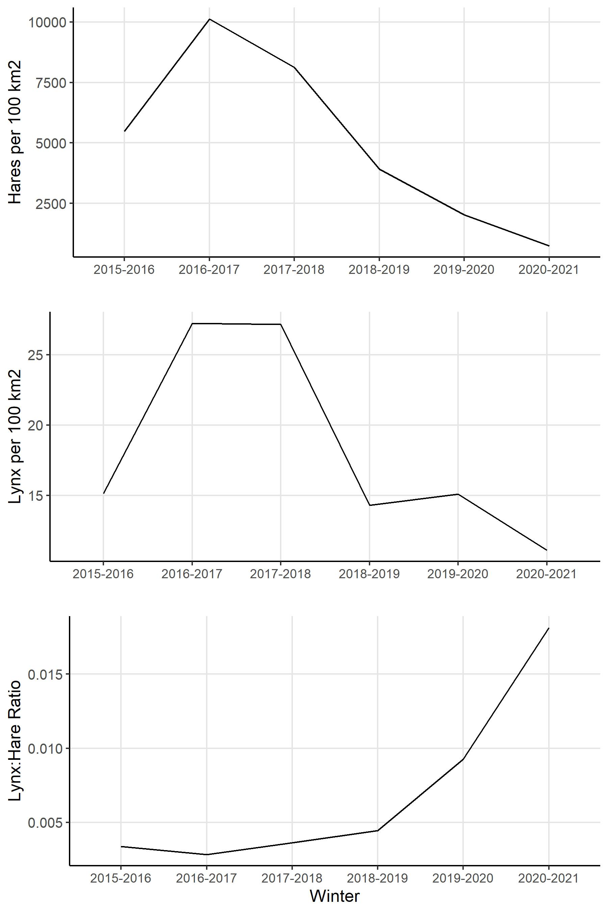
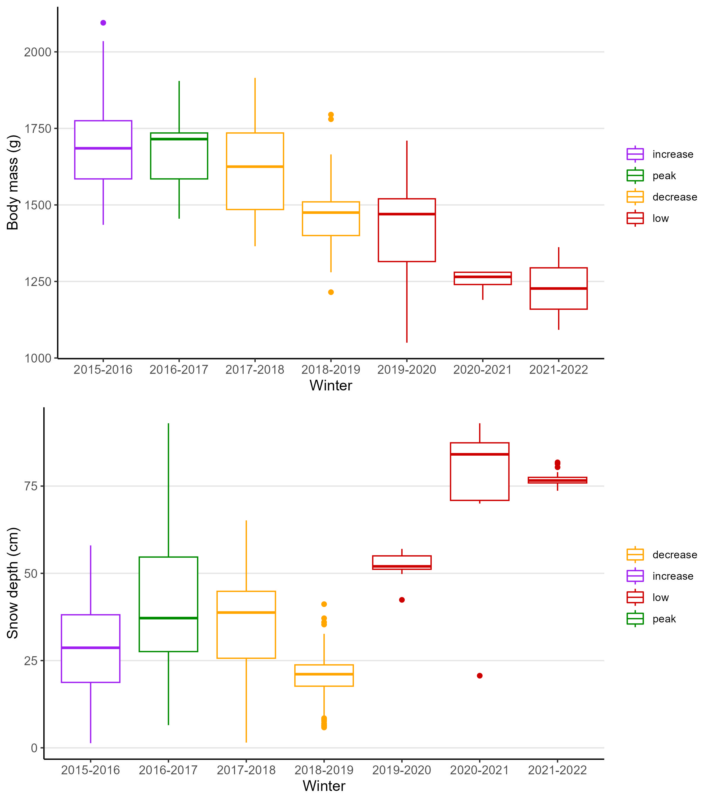
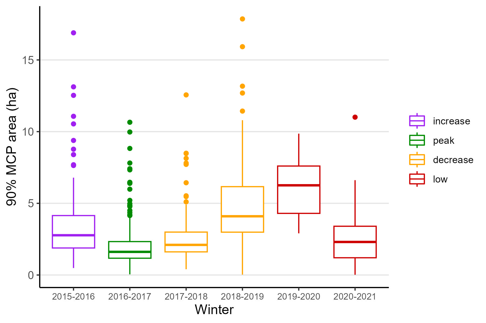

```{r setup, include=FALSE}
knitr::opts_chunk$set(echo = TRUE)
```

```{r setup, include=FALSE}
source("scripts/10-stats.R")
```

## Results

General summary

Collar deployment began in November of 2015 and occurred every winter until March of 2021. During this period, the hare cycle was in its increase phase in 2015, peaked during the 2016-2017 winter, crashed from 2017 to 2019, after which it remained in the low until 2021 (Figure 1). Mortality rates changed with the population cycle; hare mortality was lowest in 2016-2017 (cycle peak; `r dat[winter == "2016-2017", mean(mortrate)]` and highest in 2019-2020 (cycle low; `r dat[winter == "2019-2020", mean(mortrate)]` ; Figure 1). Snowshoe hare body mass was highest in the peak of the cycle (`r dat[winter == "2016-2017", mean(Weight)` g) and lowest in the low of the cycle (Figure 2; `r dat[winter == "2020-2021", mean(Weight)]` g). Some winters accumulated more snow than others, with average snow depth being `r snow[, mean(SD)]` cm. After initial data cleaning was complete, we analysed gps data from `r dat[, length(unique(id))]` individuals, totaling `r dat[, .N]` weekly home ranges. Of these individuals, `r dat[Sex == 1]` were male, `r dat[Sex == 2]` were female, and of the females `r dat[Food == 1]` were given food add treatments while collared. The mean areas of 90%, 75%, and 50% weekly home ranges (MCPs) were `r dat[, mean(M90)]` ha, `r dat[, mean(M75)]` ha, and `r dat[, mean(M50)]` ha respectively. Results from 90%, 75%, and 50% MCPs were highly correlated (r \> 0.78), and we completed all home range size analyses with the 90% MCP results.

Home range results across all cycle phases

Snowshoe hare home ranges were largest in the low of the cycle (2019-2020) and smallest in the peak of the cycle (2016-2017; Figure 3). The AIC comparison ranked the competition-resource model to be the most parsimonious for explaining cross-phase home range sizes.






