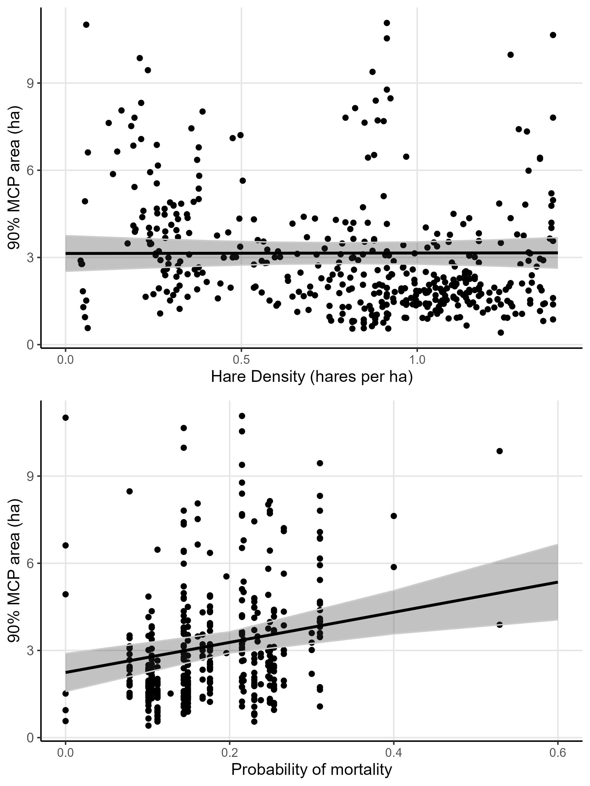
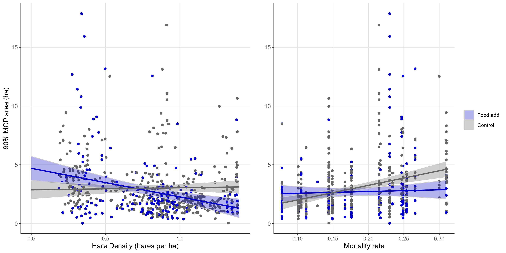

```{r setup, include=FALSE}
knitr::opts_chunk$set(echo = TRUE)
```

```{r sourcing, include=FALSE}
source("scripts/10-final_models_figures.R")
```

## Results

General summary

Collar deployment began in November of 2015 and occurred every winter until March of 2021. We conducted food add experiments starting in the 2015-2016 winter until spring of 2019. The hare cycle was increasing in 2015, peaked during the 2016-2017 winter, declined from 2017 to 2019, after which it remained in the low until 2021 (Figure 1). Mortality rates changed with the population cycle; hare mortality was lowest in 2016-2017 (cycle peak; `r dat[winter == "2016-2017", round(mean(mortrate), 2)]` and highest in 2019-2020 (cycle low; `r dat[winter == "2019-2020", round(mean(mortrate), 2)]` ; Figure 1). After initial data cleaning was complete, we analysed gps data from `r dat[, length(unique(id))]` individuals, totaling `r dat[, .N]` weekly home ranges. Home ranges were composed of an average of `r round(nfix, 0)` fixes. Of the collared individuals, `r dat[Sex == 1, .N]` were male, `r dat[Sex == 2, .N]` were female, and of the females `r dat[Food == 1, .N]` were given food add treatments while collared. The mean areas of 90%, 75%, and 50% weekly home ranges (MCPs) were `r dat[, round(mean(M90), 2)]` ha, `r dat[, round(mean(M75), 2)]` ha, and `r dat[, round(mean(M50), 2)]` ha respectively. Results from 90%, 75%, and 50% MCPs were highly correlated (r \> 0.78), and we completed all home range size analyses with the 90% MCP results.

Home range size predictors

Snowshoe hare home ranges were largest in the low of the cycle (2019-2020) and smallest in the peak of the cycle (2016-2017; Figure 2). We found no effect of sex on home range size excluding food add females (p = `round(Psex, 2)`) and therefor did not include sex in our models. Our control-only model (all years; no food add individuals) found that hares increased their home ranges with mortality rate and hare density did not significantly affect home range area. Our treatment-included model (years with food add; all individuals), conversely, found no effect of mortality rate on home range area. Instead, this model found that hares decreased their home ranges with hare density. Further, we found that food add treatment significantly interacted with both hare density and mortality rate to influence home range areas. Hares with food add decreased their home ranges in response hare density, while controls slightly increased their home ranges. Hares with food add did not alter their home ranges with mortality rate while controls increased their home ranges.





