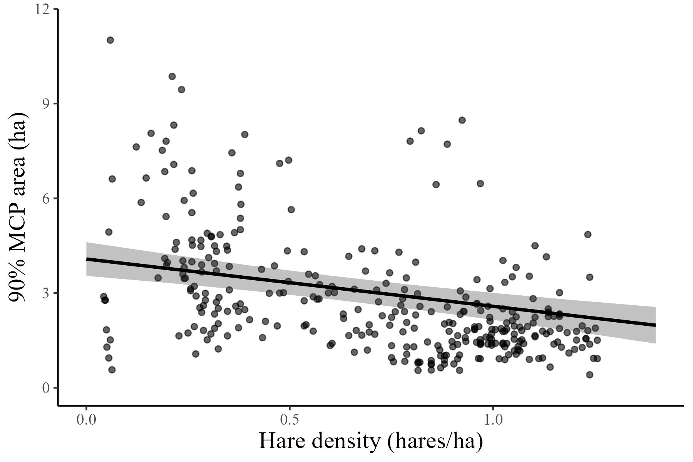
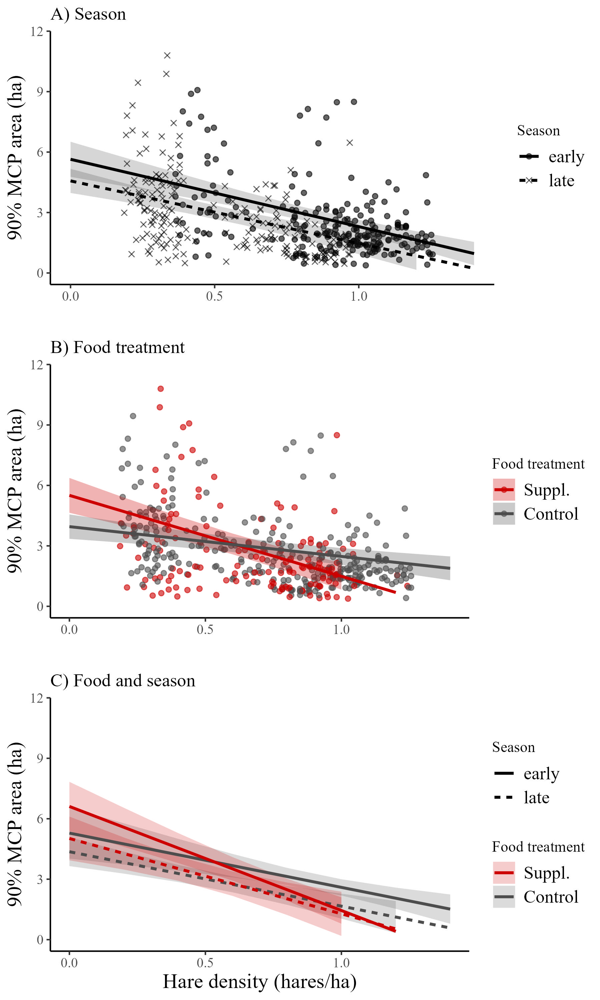

```{r setup, include=FALSE}
knitr::opts_chunk$set(echo = TRUE)
```

```{r sourcing, include=FALSE}
source("scripts/09-results_density.R")
```

## Results

General summary

The hare cycle was increasing in 2015, peaked during the 2016-2017 winter, declined from 2017 to 2019, after which it remained in the low until 2021 (Figure 1). After initial data cleaning was complete, we analysed GPS data from `r dat[, length(unique(id))]` individuals, totaling `r dat[, .N]` weekly home ranges. Home ranges were composed of an average of `r round(nfix, 0)` fixes. Within our sample, `r dat[Sex == 1, length(unique(id))]` individuals were male, `r dat[Sex == 2, length(unique(id))]` were female. Of the females, `r dat[Food == "Food add", length(unique(id))]` were food supplemented while collared. A total of `r dat[season == "early", .N]` home ranges occurred in early winter and `r dat[season == "late", .N]` in late winter; `r dat[is.na(season), .N]` occurred outside our seasonal limits (i.e., November). The mean areas of 90%, 75%, and 50% weekly home ranges (MCPs) were `r dat[, round(mean(M90), 2)]` +/- `r dat[, round(sd(M90), 2)]` ha, `r dat[, round(mean(M75), 2)]` +/- `r dat[, round(sd(M75), 2)]` ha, and `r dat[, round(mean(M50), 2)]` +/- `r dat[, round(sd(M50), 2)]` ha respectively. Results from 90%, 75%, and 50% MCPs were highly correlated (r \> 0.78), and we completed subsequent home range size analyses with the 90% MCP results.

Home range size predictors

Snowshoe hare home ranges were largest in the low of the cycle (2019-2020) and smallest in the peak of the cycle (2016-2017; Figure 1). We found no effect of sex on home range size excluding food add females (p = `r round(Psex, 2)`, t = `r round(Fsex, 2)`, df = `r round(DFsex, 2)`), so we did not include sex in our models.

Our control-only model (all years; only control individuals; n = `r nofood[, .N]`) found that hare home ranges decreased with hare density (`r round(NFdcoef, 2)` +/- `r round(NFdse, 2)` ha per hare/ha increase). As hare density increased from `r effs_NF[, min(x)]` to `r effs_NF[, max(x)]` hares/ha, hare home ranges shrunk from `r effs_NF[x == min(x), round(predicted, 2)]` ha to `r effs_NF[x == max(x), round(predicted, 2)]`.

Our seasonal model (all years; only control home ranges within seasons; n = `r nofood[, .N]`), which interacted hare density with season (early versus late winter) found a negative relationship between home range size and density (`r round(WScoef, 2)` +/- `r round(WSse, 2)`). In both cases, early winter and late winter, home ranges decreased in size with hare density (Figure 3). This model found hare density to be significant (t \> 2) toward predicting home range size, but not season or the interaction between season and density (Table 1).

Our food treatment model (years with food-add experiments; all individuals; n = `r yesfood[, .N]`), found that as hare density increased from `r effs_WF[, min(x)]` to `r effs_WF[, max(x)]` hares/ha, controls slightly decreased their home ranges from `r effs_WF[group == "Control" & x == min(x), round(predicted, 2)]` ha to `r effs_WF[group == "Control" & x == max(x), round(predicted, 2)]` ha, and food-adds substantially decreased their home ranges from `r effs_WF[group == "Food add" & x == min(x), round(predicted, 2)]` ha to `r effs_WF[group == "Food add" & x == max(x), round(predicted, 2)]` ha (Figure 3). All terms in the model, hare density, food treatment, and their interaction, were significant (t \> 2) in predicting home range size (Table 1).

The model that interacted food treatment, season, and hare density (all years with food-add experiments; home ranges within seasons; n = `r yesfood[, .N]`) also found a negative relationship between home range size and density (`r round(WFSdcoef, 2)` +/- `r round(WFSdse, 2)` ha per hare/ha increase). Regardless of scenario, season or food treatment, home ranges decreased with hare density (Figure 3). The interaction between food treatment and density remained significant (t \> 2; Table 1), with food adds in early winter showing the most negative response and controls in early winter showing the least negative response (Figure 3). The interaction between all three terms was not significant (Table 1).





