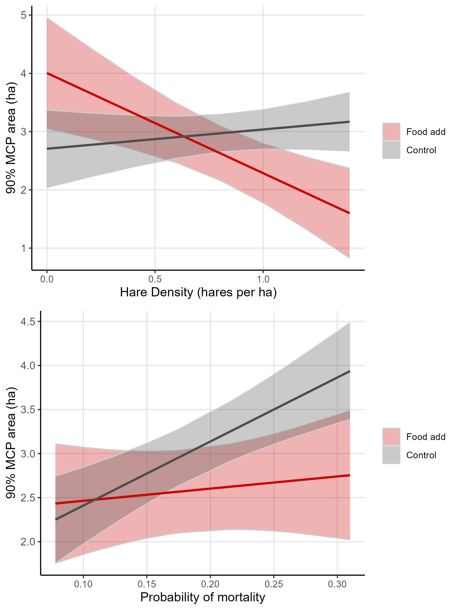

```{r setup, include=FALSE}
knitr::opts_chunk$set(echo = TRUE)
```

```{r sourcing, include=FALSE}
source("scripts/10-final_models_figures.R")
```

## Results

General summary

The hare cycle was increasing in 2015, peaked during the 2016-2017 winter, declined from 2017 to 2019, after which it remained in the low until 2021 (Figure 1). Mortality rates changed with the population cycle; hare mortality was lowest in 2016-2017 (cycle peak; `r dat[winter == "2016-2017", round(mean(mortrate), 2)]` and highest in 2019-2020 (cycle low; `r dat[winter == "2019-2020", round(mean(mortrate), 2)]` ; Figure 1). After initial data cleaning was complete, we analysed gps data from `r dat[, length(unique(id))]` individuals, totaling `r dat[, .N]` weekly home ranges. Home ranges were composed of an average of `r round(nfix, 0)` fixes. Of the collared individuals, `r dat[Sex == 1, .N]` were male, `r dat[Sex == 2, .N]` were female. Of the females, `r dat[Food == "Food add", .N]` were food supplemented while collared. The mean areas of 90%, 75%, and 50% weekly home ranges (MCPs) were `r dat[, round(mean(M90), 2)]` ha, `r dat[, round(mean(M75), 2)]` ha, and `r dat[, round(mean(M50), 2)]` ha respectively. Results from 90%, 75%, and 50% MCPs were highly correlated (r \> 0.78), and we completed subsequent home range size analyses with the 90% MCP results.

Home range size predictors

Snowshoe hare home ranges were largest in the low of the cycle (2019-2020) and smallest in the peak of the cycle (2016-2017; Figure 2). We found no effect of sex on home range size excluding food add females (p = `r round(Psex, 2)`, t = `r round(Fsex, 2)`, df = `r round(DFsex, 2)`), so we did not include sex in our models. Our control-only model (all years; no food-add individuals) found that hare home ranges showed no response to density (`r round(NFdcoef, 2)` +/- `r round(NFdse, 2)` ha per hare/ha increase in density). This model did find a significant effect of predation risk on home range size; as the risk of mortality risk from `r effsP_NF$x[1]` to `r effsP_NF$x[4]`, hare home ranges increased from `r round(effsP_NF$predicted[1], 2)` ha to `r round(effsP_NF$predicted[4], 2)` ha (se = `r round(NFpse, 2)`).

Our treatment-included model (years with food-add experiments; all individuals), found that as hare density increased from `r effsD_WF[, min(x)]` to `r effsD_WF[, max(x)]` hares/ha, controls slightly increased their home ranges from `r effsD_WF[group == "Control" & x == min(x), round(predicted, 2)]` ha to `r effsD_WF[group == "Control" & x == max(x), round(predicted, 2)]` ha, while food-adds substantially decreased their home ranges from `r effsD_WF[group == "Food add" & x == min(x), round(predicted, 2)]` ha to `r effsD_WF[group == "Food add" & x == max(x), round(predicted, 2)]` ha. Both groups increased their home ranges as mortality rates increased from `r min(effsD_WF$x)` (unit) to `r max(effsD_WF$x)` (unit), but that increase was much greater for controls (`r effsP_WF[group == "Control", round(max(predicted)-min(predicted), 2)]` ha increase) than food-adds (`r effsP_WF[group == "Food add", round(max(predicted)-min(predicted), 2)]` ha increase).



